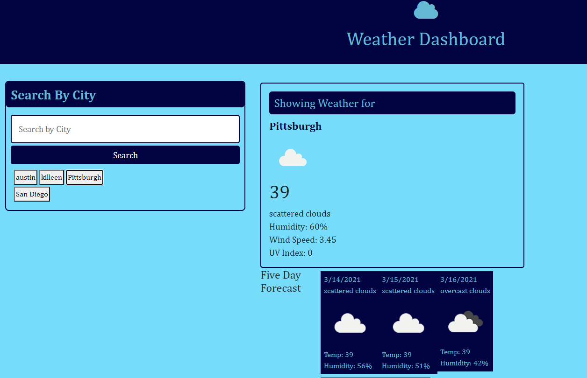

# current_weather_api
Current Weather API Project

## Installation
Click [here to check the current and 5-day forecast](https://hrkoren.github.io/current_weather_api)

## Usage 

1. Open the URL.
2. Type in a city and click the Search button.
3. View the current weather.
4. View the 5-day forecast.

## License

This project is not licensed.

## Known Issues

1. Cannot get city history list to function as buttons.
2. Cannot pull UV Index - code is there but commented out. Causes 5-day fetch to stop when not commented out.
3. Could not get the boxes arranged the way I wanted, so the layout of the page is not as intended.
4. When a new city is searched, the 5-day is not clearing and each city's just keeps iterating.

